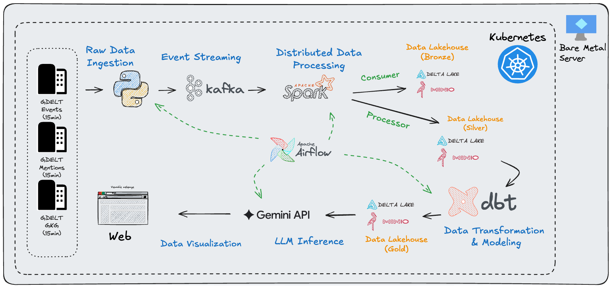
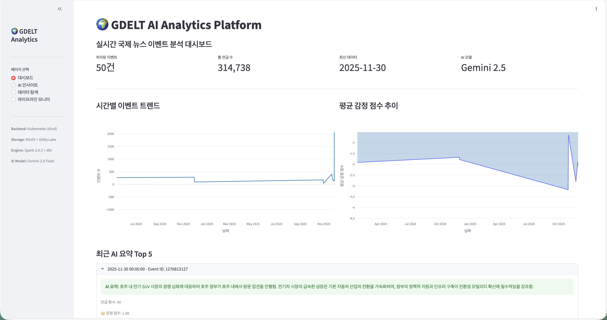
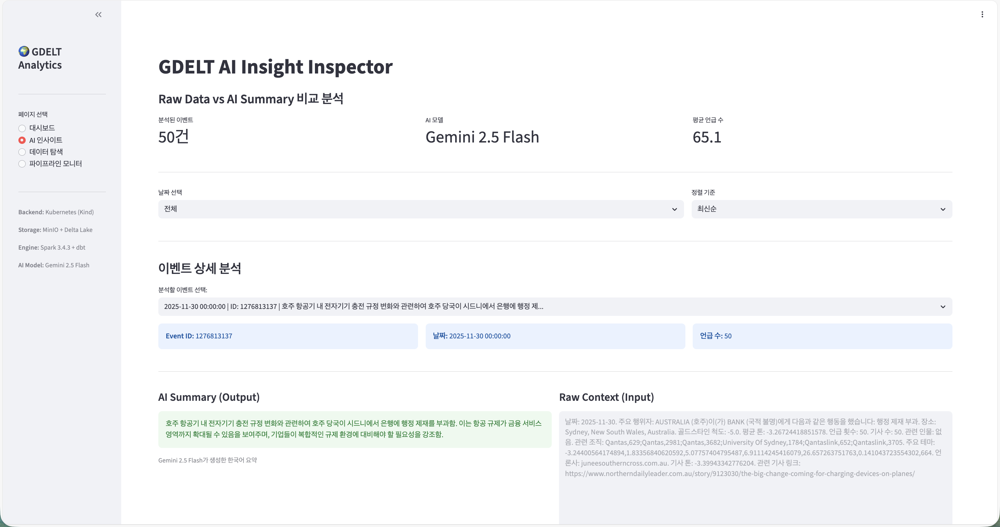
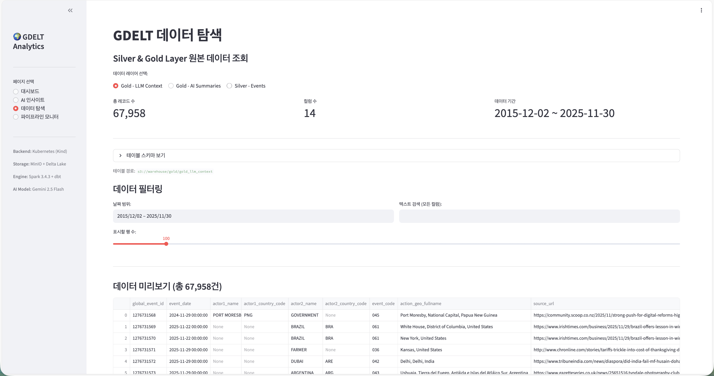
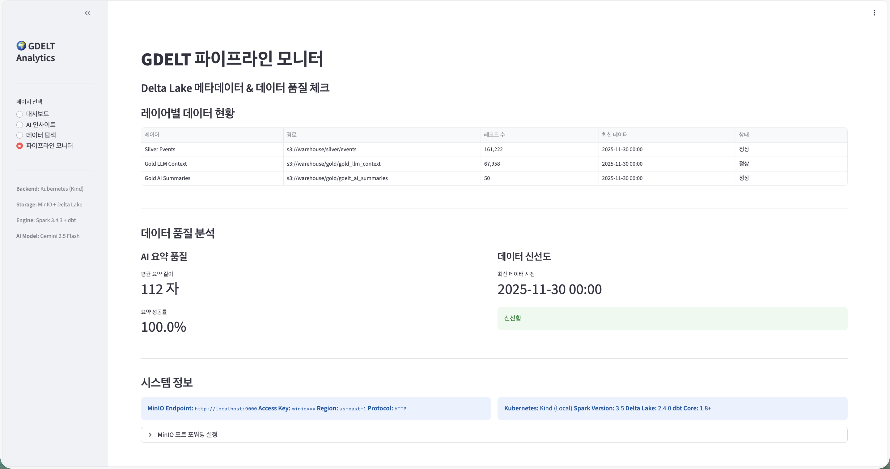

# GDELT Data Platform on Kubernetes

실시간 국제 뉴스 이벤트 데이터를 수집 및 정제 하고 LLM으로 분석하는 데이터 플랫폼

## Architecture

**Tech Stack:**
- **Orchestration**: Airflow
- **Storage**: MinIO (S3) + Delta Lake
- **Processing**: Spark 3.4.3 + dbt
- **AI**: Gemini 2.5 Flash
- **Infrastructure**: Kubernetes
- **Dashboard**: Streamlit

## Data Pipeline

### Bronze Layer 
Python Producer -> Kafka -> Spark Consumer -> MinIO(Delta Lake)
- 원본 GDELT 데이터 그대로 저장
- Path: `s3://warehouse/bronze/events`

### Silver Layer
Spark Transformation -> MinIO(Delta Lake)
- 데이터 정제 및 타입 변환
- Path: `s3://warehouse/silver/events`

### Gold Layer
dbt Transformation -> MinIO(Delta Lake)
- LLM용 컨텍스트 생성
- Path: `s3://warehouse/gold/gold_llm_context`

### AI Summary Layer
Gemini API -> MinIO(Delta Lake)
- 한국어 요약 생성
- Path: `s3://warehouse/gold/gdelt_ai_summaries`

## Dashboard Features

| 대시보드 | AI 인사이트 |
|:---:|:---:|
|  |  |
| 이벤트 트렌드, 감정 분석, 최신 요약 | Raw Data vs AI Summary 비교 |

| 데이터 탐색 | 파이프라인 모니터 |
|:---:|:---:|
|  |  |
| Silver/Gold Layer 데이터 조회 | 레이어별 상태 체크 |
