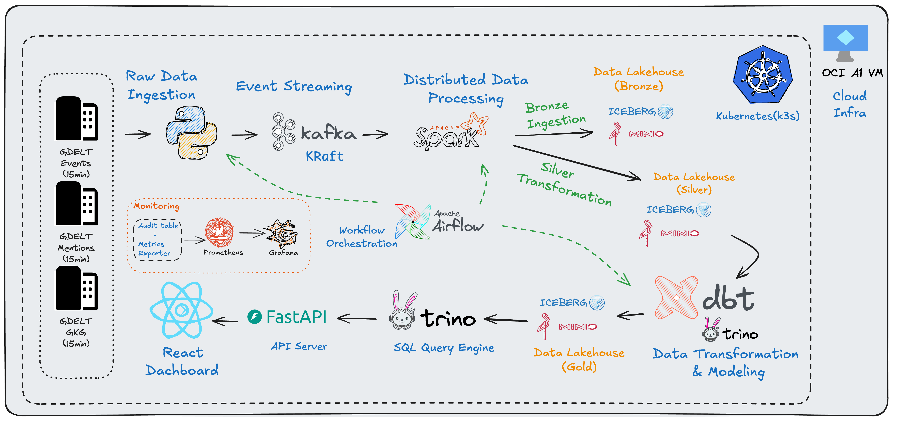

# GDELT 글로벌 뉴스 이벤트 인텔리전스 플랫폼

GDELT API로 수집한 전 세계 뉴스 이벤트 데이터를 Kafka → PySpark → Apache Iceberg → dbt-Trino → FastAPI → React로 처리하는 실시간 데이터 플랫폼. OCI A1 Ampere(ARM64) 단일 노드 k3s 위에서 완전 동작한다.


---

## 목차

1. [프로젝트 개요](#1-프로젝트-개요)
2. [아키텍처](#2-아키텍처)
3. [기술 스택](#3-기술-스택)
4. [개발 여정 — 마이그레이션 히스토리](#4-개발-여정--마이그레이션-히스토리)
5. [데이터 파이프라인 상세](#5-데이터-파이프라인-상세)
6. [Audit & 관찰성 시스템](#6-audit--관찰성-시스템)
7. [API 및 웹 대시보드](#7-api-및-웹-대시보드)
8. [인프라 및 배포](#8-인프라-및-배포)
9. [테스트 전략](#9-테스트-전략)
10. [트러블슈팅 기록](#10-트러블슈팅-기록)
11. [디렉토리 구조](#11-디렉토리-구조)
12. [로드맵](#12-로드맵)

---

## 1. 프로젝트 개요

GDELT(Global Database of Events, Language, and Tone)는 매 15분마다 전 세계 뉴스에서 국가 간 행동·분쟁·협력 이벤트를 자동 추출해 공개하는 데이터셋이다. 이 프로젝트는 GDELT 3종 데이터(Events·Mentions·GKG)를 Kafka로 수집하고, Spark와 dbt로 Bronze→Silver→Gold Medallion Architecture로 정제한 뒤 FastAPI와 React 대시보드로 제공하는 풀스택 데이터 플랫폼이다. 모든 인프라는 OCI A1 Ampere Free Tier(ARM64, 4 OCPU/24GB RAM) 위의 단일 노드 k3s 클러스터에서 운영된다.

### 핵심 수치

| 항목 | 값 |
|------|-----|
| 파이프라인 레이어 | 4단계 (Ingest → Bronze → Silver → Gold) |
| Kafka 토픽 | 3개 (events / mentions / gkg) |
| Prometheus 메트릭 | 15개 (커스텀 metrics-exporter) |
| Grafana 대시보드 | 5섹션 22패널 (Control Tower) |
| FastAPI 엔드포인트 | 9개 |
| React 페이지 | 6개 |
| 단위 테스트 | 79개 (Python 60 + Web 19) |
| Smoke 테스트 | 3개 스크립트 (E2E / Silver Quality / Gold Quality) |
| 배치 주기 | 15분 |


---

## 2. 아키텍처

### 전체 아키텍처




---

## 3. 기술 스택

| 레이어 | 기술 | 버전 | 선택 이유 |
|--------|------|------|-----------|
| 인프라 | k3s / OCI A1 Ampere ARM64 | v1.33 | OCI Free Tier 최대 활용, 경량 K8s |
| 오케스트레이션 | Apache Airflow (LocalExecutor) | 3.1.3 | KubernetesPodOperator로 Spark/dbt 격리 실행, Redis 제거 |
| 메시징 | Apache Kafka (KRaft) | 4.0.1 | Zookeeper 의존성 완전 제거, 단일 노드 단순화 |
| 처리 | PySpark + Apache Iceberg | 3.5.6 / 1.10.1 | MERGE INTO 지원, Nessie REST Catalog 통합 |
| 카탈로그 | Project Nessie (RocksDB) | 0.107.5 | Hive Metastore 대체, Git-like 브랜치, 경량 |
| 저장소 | MinIO | RELEASE.2025 | S3 호환 API, k8s 내 오브젝트 스토리지 |
| 변환 | dbt-trino | 1.10.1 | SQL-first Gold 모델, incremental MERGE, Seeds JOIN |
| 쿼리 | Trino | 480 | Nessie Iceberg 네이티브 커넥터 |
| 모니터링 | Prometheus + Grafana | v3.11.3 / 12.4.2 | 커스텀 metrics-exporter로 파이프라인 전용 메트릭 |
| 백엔드 | FastAPI + cachetools TTLCache | 0.115.12 | 비동기 API, 300s 캐시로 Trino 반복 풀스캔 차단 |
| 프론트엔드 | React 18 + Vite + TailwindCSS | 18.3 / 5 / 3 | SPA, 다크 테마(zinc-950), 30초 자동 갱신 |
| DB (메타) | PostgreSQL | 16 | Airflow 메타데이터 |

---

## 4. 개발 여정 — 마이그레이션 히스토리

### Before / After

| 항목 | 초기 구성 | 현재 구성 | 변경 이유 |
|------|----------|-----------|-----------|
| K8s 환경 | kind (로컬 bare-metal) | k3s OCI A1 Ampere | ARM64 Free Tier 활용, 운영 단순화 |
| Table Format | Delta Lake | Apache Iceberg + Nessie | 전 레이어 포맷 통일, Hive Metastore 제거 |
| Kafka 모드 | Zookeeper 3-broker | KRaft 단일 브로커 | 단일 노드에서 Zookeeper 오버헤드 제거 |
| 모니터링 | Elasticsearch + Kibana | Prometheus + Grafana | 파이프라인 메트릭 특화, 메모리 절감 |
| Silver 처리 방식 | createOrReplace() | MERGE INTO + source_batch_id | Airflow 3.x 렌더링 버그 우회 + 멱등성 보장 |
| DAG Operator | BashOperator | KubernetesPodOperator | Spark/dbt 실행 환경 격리, ARM64 이미지 적용 |
| Airflow Executor | CeleryExecutor + Redis | LocalExecutor | 단일 노드에서 Redis 제거, 리소스 절감 |

### Delta Lake → Apache Iceberg 마이그레이션

**배경:** Bronze/Silver에 Delta Lake를 쓰고 Gold는 dbt-spark+Delta로 처리하면, Trino가 Silver(Iceberg)를 읽기 위해 Delta connector와 Hive Metastore가 추가로 필요해진다. 전체 레이어를 Iceberg로 통일하는 것이 의존성이 적다는 결론을 내렸다.

**가장 까다로웠던 문제 — `HadoopFileIO` vs `S3FileIO`:**

Iceberg 기본값인 `S3FileIO`는 AWS SDK v2를 요구하지만, ARM64 Spark 이미지에는 v1(S3A/Hadoop)만 포함돼 있어 `NoClassDefFoundError`가 발생했다. `HadoopFileIO`로 명시적 설정함으로써 S3A(SDK v1) 경로로 우회 해결했다.

```python
# apps/spark-jobs/utils/spark_builder.py
SparkSession.builder
  .config("spark.sql.extensions",
          "org.apache.iceberg.spark.extensions.IcebergSparkSessionExtensions")
  # Nessie REST Catalog
  .config("spark.sql.catalog.nessie",           "org.apache.iceberg.spark.SparkCatalog")
  .config("spark.sql.catalog.nessie.type",      "rest")
  .config("spark.sql.catalog.nessie.uri",       nessie_uri)
  .config("spark.sql.catalog.nessie.warehouse", "warehouse")
  # S3FileIO(SDK v2) 대신 HadoopFileIO(S3A/SDK v1) 강제
  .config("spark.sql.catalog.nessie.io-impl",
          "org.apache.iceberg.hadoop.HadoopFileIO")
  .config("spark.hadoop.fs.s3a.endpoint", os.getenv("MINIO_ENDPOINT"))
  .config("spark.hadoop.fs.s3a.impl",    "org.apache.hadoop.fs.s3a.S3AFileSystem")
```

**Nessie RocksDB 배포 주의사항:** 기본값인 in-memory 설정은 pod 재시작 시 전체 메타데이터가 사라진다. RocksDB + PVC 마운트를 적용하고, deployment strategy를 `Recreate`로 설정해 RollingUpdate 중 두 pod가 동시에 RocksDB에 접근하는 락 충돌을 방지했다.

### source_batch_id 멱등성 아키텍처

**문제 1 — Airflow 3.x 렌더링 버그:**
KubernetesPodOperator에서 템플릿 변수 `{{ data_interval_start }}`와 `{{ data_interval_end }}`가 동일한 값으로 렌더링되는 버그로, Silver의 시간 범위 필터가 0건을 반환했다.

**문제 2 — `createOrReplace()` 누적 데이터 손실:**
Silver 처리에서 매 실행마다 전체 테이블을 덮어쓰는 방식은, 배치가 재실행될 때 이전 배치의 데이터를 파괴했다.

**해결:** `source_batch_id = YYYYMMDDHHMMSS`를 Kafka 메시지 생성 시점부터 삽입하고, Airflow DAG이 `SOURCE_BATCH_ID` 환경 변수로 각 pod에 전달한다. Bronze는 이 값을 파티션 키로, Silver는 `WHERE source_batch_id = '...'` 필터로 사용한다. MERGE INTO가 동일 `global_event_id`에 대해 멱등성을 보장하므로 재실행해도 결과가 동일하다.

```python
# Airflow DAG에서 배치 ID 생성
SOURCE_BATCH_ID = "{{ data_interval_start.strftime('%Y%m%d%H%M%S') }}"
```

**mention_id null-safe 처리:** `concat_ws("|", cols...)`는 null을 묵묵히 skip하므로, `coalesce(col, "__NULL__")`로 null을 문자열로 치환한 뒤 SHA256 해시로 mention_id를 생성했다.

### Zookeeper → KRaft 전환

Kafka 4.0.1에서 ZooKeeper를 완전 제거하고 KRaft 단일 브로커로 운영한다. 단일 노드 환경에서 Zookeeper pod가 차지하던 리소스를 절약하고, 배포 구성이 단순해졌다.

---

## 5. 데이터 파이프라인 상세

### Bronze Layer — 원본 수집

Airflow DAG `gdelt_bronze_to_silver`가 15분마다(`0,15,30,45 * * * *`) 실행된다.

```
gdelt_producer >> bronze_consumer >> silver_processor >> trigger_gold
```

- `gdelt_producer` (BashOperator): GDELT API 폴링, Kafka 3개 토픽으로 발행
- `bronze_consumer` (KubernetesPodOperator): Iceberg Bronze 테이블에 MERGE INTO
- `silver_processor` (KubernetesPodOperator): 3-Way Join, Silver 테이블에 MERGE INTO
- `trigger_gold` (TriggerDagRunOperator): `gdelt_silver_to_gold` DAG 트리거

**MERGE 키:**

| 테이블 | MERGE 키 |
|--------|----------|
| `nessie.bronze.gdelt_events` | `GLOBALEVENTID` |
| `nessie.bronze.gdelt_mentions` | `SHA256(event_id \| date \| source_url)` |
| `nessie.bronze.gdelt_gkg` | `GKGRECORDID` |

Iceberg MERGE INTO 시 Spark의 `global_temp` 뷰를 경유한다. Iceberg SQL parser가 일반 temp view를 Nessie catalog에서 찾으려 해서 `global_temp.{view_name}` 형식이 필수다.

### Silver Layer — 3-Way Bridge Join

Bronze 3개 테이블에서 이벤트 단위로 데이터를 통합하고, `global_event_id` 기준으로 1 row를 생성한다.

```
직접 join(Events × Mentions) 방식은 row explosion을 일으켜 global_event_id 중복이 발생.
Bridge aggregation 패턴으로 전환:

① events.dropDuplicates(["global_event_id"])

② bridge = mentions_slim LEFT JOIN gkg_slim
           ON mention_identifier = document_identifier

③ event_enrichment = bridge.groupBy("global_event_id").agg(
       count("*").alias("num_mentions"),
       avg("mention_doc_tone").alias("avg_tone"),
       first("mention_source_name"),
       first("v2_persons"),        # GKG 엔티티
       first("v2_organizations"),
       first("v2_enhanced_themes")
   )

④ result = events_dedup LEFT JOIN event_enrichment ON global_event_id

→ nessie.silver.gdelt_events_detailed  (1 row per global_event_id)
```

### Gold Layer — dbt incremental MERGE

```sql
-- apps/dbt/models/marts/gold_llm_context.sql
{{ config(
    materialized='incremental',
    unique_key='global_event_id',
    incremental_strategy='merge',
    incremental_predicates=[
        "DBT_INTERNAL_DEST.event_date >= current_date - interval '7' day"
    ],
    properties={
        "format": "'PARQUET'",
        "partitioning": "ARRAY['event_date']"
    }
) }}
```

`event_date` 파티션과 `incremental_predicates`를 함께 설정해 MERGE 시 Gold 테이블 스캔 범위를 최근 7일 파티션으로 제한했다. 이 조합이 없으면 MERGE 시 target Gold 테이블의 넓은 범위를 스캔하게 되어 Trino 메모리 사용량이 급증했고, 실제 운영 중 OOMKilled가 발생했다.

Gold 테이블의 핵심 컬럼인 `llm_content_text`는 이벤트 상세 조회와 외부 소비를 위한 한국어 Gold context 문자열로 생성한다:

```sql
concat(
    '날짜: ',        cast(s.event_date as varchar),
    '. 행위자1: ',   coalesce(s.actor1_name, '미상'),
    ' (',            coalesce(c1.name_kor, s.actor1_country_code, '국적불명'), ')',
    ' → 행위자2: ', coalesce(s.actor2_name, '미상'),
    ' (',            coalesce(c2.name_kor, s.actor2_country_code, '국적불명'), ')',
    '. 이벤트: ',    coalesce(ec.description, s.event_code, 'N/A'),
    '. 골드스타인: ',coalesce(cast(s.goldstein_scale as varchar), 'N/A'),
    '. 톤: ',        coalesce(cast(s.avg_tone as varchar), 'N/A'),
    '. 언급횟수: ',  coalesce(cast(s.num_mentions as varchar), '0'),
    '. 관련인물: ',  coalesce(s.v2_persons, '없음'),
    '. 관련조직: ',  coalesce(s.v2_organizations, '없음'),
    '. 테마: ',      coalesce(s.v2_enhanced_themes, '없음'),
    '. URL: ',       coalesce(s.source_url, '없음')
) as llm_content_text
```

Seeds로 CAMEO 이벤트 코드(`event_detail_codes`) 및 국가 코드(`geo_country_codes`, 한국어명 포함)를 JOIN해 사람이 읽을 수 있는 이벤트 맥락을 생성한다. 현재 대시보드는 이 Gold mart를 이벤트 탐색과 상세 조회의 serving layer로 사용한다.

---

## 6. Audit & 모니터링 시스템

### 설계 원칙

1. **Audit 테이블 = 유일한 Source of Truth.** Prometheus는 요약 projection만 제공한다.
2. **append-only.** DELETE/UPDATE 금지. 복구는 최신 success INSERT 기준이다.
3. **Prometheus label에 batch_id/error_message 없음.** cardinality 폭증을 방지한다.
4. **Trino 장애 시 exporter HTTP 200 + `gdelt_exporter_up=0` 반환.** 절대 500이 되지 않는다.

### pipeline_batch_runs 스키마

| 컬럼 | 타입 | 설명 |
|------|------|------|
| `batch_id` | VARCHAR | `YYYYMMDDHHMMSS` (Airflow data_interval_start 기준) |
| `stage` | VARCHAR | `bronze` / `silver` / `gold` |
| `status` | VARCHAR | `success` / `failed` / `skipped` |
| `input_rows` | BIGINT | 처리 전 row 수 |
| `output_rows` | BIGINT | 처리 후 row 수 |
| `started_at` | TIMESTAMP | 작업 시작 UTC |
| `finished_at` | TIMESTAMP | 작업 완료 UTC |
| `duration_seconds` | DOUBLE | 소요 시간 |
| `error_message` | VARCHAR | 실패 시 오류 메시지 (최대 500자) |

**E2E complete 배치 판정 SQL:**

```sql
SELECT batch_id
FROM nessie.audit.pipeline_batch_runs
WHERE stage IN ('bronze', 'silver', 'gold') AND status = 'success'
GROUP BY batch_id
HAVING COUNT(DISTINCT stage) = 3
ORDER BY MAX(finished_at) DESC
LIMIT 1
```

Bronze·Silver·Gold 3개 스테이지가 동일 `batch_id`로 모두 success인 배치가 E2E complete로 판정된다.

### Prometheus 메트릭 (metrics-exporter, 15개)

| 메트릭 | 설명 |
|--------|------|
| `gdelt_pipeline_stage_success{stage}` | 스테이지별 최신 성공(1)/실패(0) |
| `gdelt_pipeline_stage_duration_seconds{stage}` | 스테이지별 최근 처리 시간 |
| `gdelt_latest_batch_output_rows{stage}` | 스테이지별 최근 출력 row 수 |
| `gdelt_pipeline_freshness_seconds` | 마지막 E2E complete 배치 후 경과 시간 |
| `gdelt_pipeline_health` | freshness < 1800s AND E2E complete = 1 |
| `gdelt_e2e_complete_batch_available` | E2E complete 배치 존재 여부 |
| `gdelt_e2e_duration_seconds` | bronze 시작 → gold 완료 E2E 소요 시간 |
| `gdelt_current_e2e_batch_id` | 최신 E2E complete batch_id (숫자 변환) |
| `gdelt_bronze_to_silver_retention_ratio` | silver output / bronze input 비율 |
| `gdelt_failed_stage_count` | 최근 24h 실패 스테이지 수 |
| `gdelt_gold_table_total_rows` | gold 테이블 총 row 수 |
| `gdelt_silver_dedup_violation_count` | silver global_event_id 중복 건수 |
| `gdelt_silver_core_null_count` | silver 핵심 컬럼 null 건수 |
| `gdelt_silver_mention_join_ratio` | mention join 성공 비율 |
| `gdelt_silver_gkg_coverage_ratio` | GKG 데이터 커버리지 비율 |

### Grafana Control Tower (5섹션 22패널)

| 섹션 | 주요 패널 |
|------|----------|
| Control Tower | E2E batch_id / freshness_seconds / pipeline_health 신호등 |
| Batch Flow | 스테이지별 output_rows / duration_seconds / 성공·실패 상태 |
| Data Quality Gate | retention_ratio / dedup_violations / mention_join_ratio / gkg_coverage |
| Trends | 시계열 배치 처리량 / E2E duration 추이 |
| Lakehouse Storage | gold 테이블 총 row 수 |


---

## 7. API 및 웹 대시보드

### FastAPI 엔드포인트

| 엔드포인트 | 설명 |
|------------|------|
| `GET /api/health` | 헬스체크 |
| `GET /api/stats` | KPI 요약 (total_processed_events / recent_events / avg_tone / high_risk_count / window_days=7) |
| `GET /api/batches` | 배치 목록 (source_batch_id별 event count) |
| `GET /api/events` | 이벤트 목록 (actor1 / event_code / date / geo 필터, 페이지네이션) |
| `GET /api/events/{id}` | 이벤트 상세 (Gold context 포함) |
| `GET /api/signals` | 고위험 이벤트 (risk_score 내림차순) |
| `GET /api/hotspots` | 지역별 핫스팟 (metric: events / tone / mentions / goldstein) |
| `GET /api/audit/runs` | audit 실행 목록 (stage / status 필터, limit 1-200) |
| `GET /api/audit/runs/{batch_id}` | 배치 상세 (14자리 batch_id, 스테이지별 breakdown) |

전 엔드포인트에 `TTLCache(maxsize=200, ttl=300)`를 적용해 5분 동안 동일 쿼리를 Trino에 반복 전달하지 않는다.

### /stats 쿼리 최적화

`total_processed_events`는 gold 테이블 풀스캔 없이 audit 테이블에서 `SUM(output_rows)`로 계산한다. `avg_tone`, `high_risk_count`, `recent_events`는 `event_date >= current_date - interval '7' day` 필터로 event_date 파티션 pruning을 활용한다.

```json
{
  "total_processed_events": 1312734,
  "recent_events": 718083,
  "avg_tone": -1.866,
  "high_risk_count": 8088,
  "window_days": 7
}
```

### Signals risk_score 공식

```sql
(ABS(COALESCE(avg_tone, 0)) * LN(COALESCE(num_mentions, 1) + 1))
/ NULLIF(COALESCE(goldstein_scale, 0) + 10, 0)
```

분모 `goldstein_scale + 10`이 0이 될 때(`goldstein_scale = -10`) `inf`가 발생해 Signals 페이지 전체가 500 오류를 냈다. `NULLIF(..., 0)`으로 null 처리하고 Python에서 `inf` 필터를 추가해 회귀 테스트로 방어했다.

### React SPA

| 페이지 | 설명 |
|--------|------|
| Dashboard | KPI 4개 + 7일 Top Event Codes + High Risk Signals 미리보기 |
| EventsExplorer | actor1 / event_code / date / geo 다중 필터, 페이지네이션, Sheet 상세 패널 |
| BatchMonitor | 배치 목록 30초 자동 갱신, LIVE 배지 |
| Signals | risk_score 기반 고위험 이벤트 모니터 |
| Hotspots | 지역별 이벤트 집중도 (4개 metric 선택) |
| Audit | pipeline_batch_runs 히스토리, StageBadge / StatusBadge 필터 |


---

## 8. 인프라 및 배포

### OCI A1 Ampere 제약과 최적화

- **Spark driver 메모리 하드 제한 2g** — `SPARK_DRIVER_MEMORY=2g` 환경변수로 강제. 초과 시 다른 서비스 OOM 연쇄 발생.
- **Trino JVM -Xmx4G** — `query.max-memory-per-node=2800MB`, `memory.heap-headroom-per-node=1GB` 조합으로 안전 마진 확보.


### 커스텀 Docker 이미지

| 이미지 | 태그 | 포함 내용 |
|--------|------|-----------|
| `juxpkr/gdelt-spark` | `spark3.5.6-iceberg1.10.1-awsbundle-s3a-java17-arm64` | PySpark 3.5.6, Iceberg JAR, Hadoop-AWS S3A, iceberg-aws-bundle, Java 17 |
| `juxpkr/gdelt-dbt` | `trino1.10.1-core1.11.8-python3.12-arm64` | dbt-trino 1.10.1, dbt-core 1.11.8, trino-python-client |
| `juxpkr/gdelt-metrics-exporter` | `0.1.4-arm64` | FastAPI, prometheus-client, cachetools, trino-python-client |
| `juxpkr/gdelt-api` | `0.1.0-arm64` | FastAPI 0.115.12, uvicorn, trino-python-client |
| `juxpkr/gdelt-web` | `0.1.0-arm64` | React 18 빌드 산출물, nginx 1.27-alpine |

JAR과 패키지를 이미지에 사전 포함시켜 pod cold start 시 Maven/PyPI 다운로드를 없앴다.

### K8s 배포 구조

```
deploy/overlays/k3s-oci/
├── namespace.yaml
├── postgres/postgres.yaml          # PostgreSQL 16, PVC 10Gi
├── kafka/kafka.yaml                # Kafka 4.0.1 KRaft, PVC 10Gi
├── minio/minio.yaml                # MinIO, PVC 50Gi
├── minio/minio-init-job.yaml       # warehouse 버킷 초기화
├── nessie/nessie.yaml              # Nessie 0.107.5, PVC 5Gi (RocksDB, Recreate)
├── trino/trino.yaml                # Trino 480, JVM -Xmx4G
├── airflow/values.yaml             # Helm chart 1.20.0, LocalExecutor
├── monitoring/
│   ├── prometheus.yaml             # Prometheus v3.11.3, PVC 5Gi, 7일 retention
│   ├── grafana.yaml                # Grafana 12.4.2, PVC 2Gi
│   ├── grafana-provisioning.yaml   # 대시보드 ConfigMap (자동 복원)
│   └── gdelt-metrics-exporter.yaml
└── dashboard/
    ├── api.yaml                    # FastAPI Deployment + Service
    ├── web.yaml                    # React/nginx Deployment + Service
    └── ingress.yaml                # Traefik IngressRoute
```

Airflow DAG과 Spark jobs는 hostPath 마운트(`/home/ubuntu/gdelt-data-platform-k8s/apps/`)로 연결된다. 코드 변경이 pod 재시작 없이 즉시 반영된다.

---

## 9. 테스트 전략

### 테스트 도입 배경 — 실제 장애 3건

테스트 없이 운영하다 발생한 장애들이 TDD 도입의 직접적 동기가 됐다.

1. **goldstein=-10 → risk_score `inf` → Signals 페이지 전체 500** — Pydantic이 `float('inf')` 직렬화에 실패. `NULLIF(goldstein_scale + 10, 0)` 추가 후 회귀 테스트 작성.
2. **`SOURCE_BATCH_ID` 환경변수 누락 → 스테이지별 batch_id 불일치** — Bronze/Silver/Gold가 각기 다른 batch_id를 쓰면 audit에서 E2E complete 판정이 불가능해진다. `_resolve_batch_id()`의 fallback 로직을 테스트로 명세화.
3. **Pydantic v2 `Optional[str]` default 없음 → audit API 전체 500** — schema 변경 후 `Optional[str] = None`을 빠뜨리면 필수 필드가 돼 validation 오류 발생. 스키마 계약 테스트로 방어.

### 단위 테스트 구성 (79개)

| 레이어 | 파일 | 개수 | 검증 대상 |
|--------|------|------|-----------|
| Spark | `test_pipeline_audit_writer.py` | 6 | `write_audit()` SQL 생성, single-quote 이스케이프, 500자 truncate |
| Spark | `test_bronze_consumer.py` | 4 | `_resolve_batch_id()` env var/공백/fallback 14자리 포맷 |
| Spark | `test_silver_processor.py` | 6 | `_skip_reason()` 조건 분기 (bronze 없음 / silver 미존재 등) |
| API | `test_audit_router.py` | 10 | stage/status 검증, batch_id 정규식, SQL injection 방어 |
| API | `test_cache.py` | 8 | TTLCache set/get/clear, key determinism, 테스트 격리 |
| API | `test_signals_router.py` | 6 | risk_score inf 방어, Trino 장애 시 500, limit 범위 |
| metrics | `test_pipeline_collector.py` | 5 | E2E batch 선택 로직, stage 누락 fallback |
| metrics | `test_freshness_collector.py` | 5 | freshness 계산, health 판정 임계값 (1800s) |
| metrics | `test_metrics_endpoint.py` | 5 | Trino 장애 시 exporter_up=0, HTTP 200 보장, label cardinality 방어 |
| metrics | `test_silver_quality_collector.py` | 5 | dedup_violations, core_null, mention_join_ratio |
| Web | `EventDetailPanel.test.tsx` | 15 | 이벤트 상세 패널 렌더링, 엔티티 분리, 미구현 요약 UI 미노출 |
| Web | `Audit.test.tsx` | 4 | Audit 페이지 stage/status 표시와 빈 상태 처리 |

> FastAPI monkeypatch 대상은 `routers.<module>.fetch_all`. `db.trino.fetch_all`을 직접 패치하면 import 타이밍에 따라 무효화된다.

### Smoke 테스트 (운영 클러스터 검증)

| 스크립트 | 검증 항목 |
|----------|----------|
| `check_e2e_batch.py` | E2E complete 배치 freshness / gold dedup / audit row 수 일치 |
| `check_silver_quality.py` | retention_ratio / dedup_violations / core_null / mention_join_ratio / gkg_coverage |
| `check_gold_quality.py` | gold row 수 / dedup / Gold context 최소 길이 / 최신 audit 일치 |

```bash
make smoke-silver-quality   # exit 0 (pass) / exit 1 (fail)
make smoke-gold
```

### dbt 데이터 계약 (schema.yml)

`gold_llm_context` 주요 컬럼 계약: `global_event_id` (not_null, unique), `event_date` (not_null), `event_code` (not_null), `source_batch_id` (not_null), `gold_processed_at` (not_null), `llm_content_text` (not_null). `dbt test`로 파이프라인 실행 후 자동 검증한다.

---

## 10. 트러블슈팅 기록

실제 운영 중 발생했던 주요 장애와 해결 방법이다.

| 문제 | 원인 | 해결 |
|------|------|------|
| `Warehouse 's3a://warehouse/' is not known` | Nessie 서버에 warehouse 미등록 | `NESSIE_CATALOG_WAREHOUSES_WAREHOUSE_LOCATION=s3a://warehouse/` 환경변수 추가 |
| `NoClassDefFoundError: software/amazon/awssdk/...` | Iceberg S3FileIO가 AWS SDK v2 요구, ARM64 이미지엔 v1(S3A)만 포함 | `nessie.io-impl=HadoopFileIO` 강제 설정 (S3A/SDK v1 사용) |
| Nessie CrashLoopBackOff (RocksDB 락 충돌) | RollingUpdate 중 신/구 pod가 동시에 동일 PVC의 RocksDB 접근 | deployment strategy `Recreate`로 변경 |
| Silver 처리 결과 0건 | Airflow 3.x KubernetesPodOperator에서 `data_interval_start == data_interval_end` 렌더링 버그 | `processed_at` 범위 필터 제거, `source_batch_id` 단일 인자로 전환 |
| mention_id SHA256 충돌 | `concat_ws`가 null을 skip → 서로 다른 행이 동일한 해시값 생성 | `coalesce(col, "__NULL__")` null-safe 처리 추가 |
| Signals 페이지 전체 500 | `goldstein_scale = -10` → 분모 0 → `risk_score = inf` → Pydantic 직렬화 실패 | `NULLIF(goldstein_scale + 10, 0)` + Python `inf` 필터, 회귀 테스트 추가 |
| Trino OOMKilled (Gold MERGE) | incremental_predicates 범위가 전체 데이터를 커버해 1.5M row 전체 스캔 | `event_date` 파티션 + 7일 predicates 설정, Trino JVM -Xmx4G |
| Grafana 전체 No data | Prometheus `scrape_timeout=10s`(기본값) < metrics-exporter 응답 시간(15~30s) | `scrape_interval: 60s`, `scrape_timeout: 55s`로 조정 |

---

## 11. 디렉토리 구조

```
.
├── apps/
│   ├── airflow/dags/
│   │   ├── gdelt_bronze_to_silver_dag.py   # 15분 스케줄, Producer→Bronze→Silver→Gold
│   │   └── gdelt_silver_to_gold_dag.py     # dbt incremental MERGE + audit 기록
│   ├── spark-jobs/
│   │   ├── ingestion/
│   │   │   ├── gdelt_producer.py           # GDELT API 폴링, Kafka 발행
│   │   │   └── gdelt_bronze_consumer.py    # Kafka 소비, Iceberg MERGE INTO
│   │   ├── processing/
│   │   │   ├── gdelt_silver_processor.py   # 3-way join orchestrator
│   │   │   ├── joiners/
│   │   │   │   └── gdelt_three_way_joiner.py  # Bridge aggregation join
│   │   │   └── transformers/
│   │   │       ├── events_transformer.py   # 58+ GDELT 이벤트 필드 추출
│   │   │       ├── mentions_transformer.py
│   │   │       └── gkg_transformer.py      # persons / organizations / themes
│   │   ├── audit/
│   │   │   └── pipeline_audit_writer.py    # write_audit() 공통 함수
│   │   ├── utils/
│   │   │   └── spark_builder.py            # get_spark_session() (Nessie REST catalog)
│   │   └── tests/                          # pytest 단위 테스트 (16개)
│   ├── dbt/
│   │   ├── models/marts/
│   │   │   └── gold_llm_context.sql        # incremental MERGE, event_date 파티션
│   │   └── seeds/
│   │       ├── event_detail_codes.csv      # CAMEO 이벤트 코드 → 설명
│   │       └── geo_country_codes.csv       # ISO 코드 → 국가명(한국어)
│   ├── api/
│   │   ├── routers/                        # stats / events / signals / hotspots / audit / batches
│   │   ├── models/schemas.py               # Pydantic 응답 모델
│   │   ├── cache.py                        # TTLCache(maxsize=200, ttl=300s)
│   │   ├── db/trino.py                     # fetch_all / fetch_one 헬퍼
│   │   └── tests/                          # pytest 단위 테스트 (24개)
│   ├── web/src/
│   │   ├── pages/                          # Dashboard / EventsExplorer / BatchMonitor
│   │   │                                   # Signals / Hotspots / Audit
│   │   ├── components/                     # EventDetailPanel / EventsTable / FilterBar / StatCard
│   │   └── api/                            # client.ts / types.ts
│   └── metrics-exporter/
│       ├── collectors/                     # pipeline / freshness / e2e / silver_quality
│       ├── db/trino.py
│       └── tests/                          # pytest 단위 테스트 (20개)
├── deploy/overlays/k3s-oci/                # K8s 매니페스트 (ARM64 최적화)
│   ├── monitoring/                         # Prometheus / Grafana / metrics-exporter
│   └── dashboard/                          # FastAPI / React / Traefik IngressRoute
├── tools/smoke/
│   ├── check_e2e_batch.py
│   ├── check_silver_quality.py
│   └── check_gold_quality.py
└── Makefile                                # 전체 배포 자동화
```

---

## 12. 로드맵

### 완료

- [x] kind → k3s OCI A1 Ampere ARM64 마이그레이션
- [x] Airflow 3.x 업그레이드 (LocalExecutor, Redis 제거)
- [x] Kafka KRaft 전환 (Zookeeper 제거)
- [x] Elasticsearch → Prometheus + Grafana 교체
- [x] Delta Lake → Apache Iceberg 전면 전환 (Bronze / Silver / Gold)
- [x] Nessie REST Catalog 배포 (RocksDB + PVC, Recreate 전략)
- [x] Bronze 파이프라인 (Kafka → Iceberg MERGE INTO, source_batch_id 멱등성)
- [x] Silver 파이프라인 (3-Way Bridge Join, MERGE INTO, dedup)
- [x] Trino 480 배포 및 Nessie Iceberg 카탈로그 연결
- [x] dbt-trino Gold 파이프라인 (incremental MERGE, event_date 파티션)
- [x] Audit 관찰성 시스템 (pipeline_batch_runs, write_audit(), E2E batch_id 추적)
- [x] Prometheus metrics-exporter 15개 메트릭, ARM64 이미지 (0.1.4)
- [x] Grafana Control Tower 대시보드 (5섹션 22패널, ConfigMap 프로비저닝)
- [x] FastAPI 백엔드 9개 엔드포인트 (Trino 연결, TTLCache 300s)
- [x] React 프론트엔드 6페이지 (다크 테마, 30초 자동 갱신)
- [x] TDD 79개 구성 (Python 60 + Web 19)
- [x] Smoke 테스트 3개 (E2E / Silver Quality / Gold Quality)
- [x] ARM64 커스텀 Docker 이미지 5종

### 미완료

- [ ] **K8s Secret** — MinIO / Kafka / Trino 자격증명 Secret으로 전환
- [ ] **데이터 카탈로그** — OpenMetadata 도입 검토 중
- [ ] **Iceberg Maintenance 정책** — snapshot expiration, orphan file cleanup, 필요 시 Gold 중심 retention 검토
- [ ] **Iceberg Retention 정책** — bronze 3일 / silver 7일 / gold 14일 자동 정리 DAG
